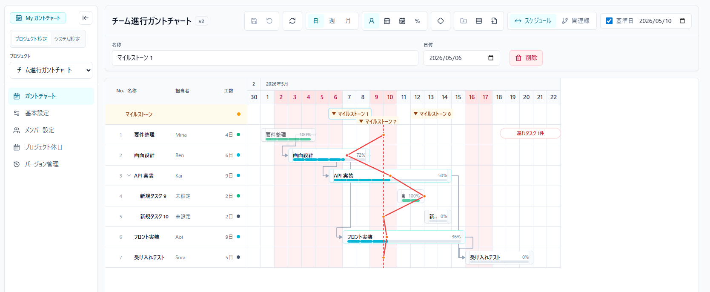

# README.md

# Gantt Chart Web Application

React + Spring Boot + H2 Database による
高性能ガントチャートWebアプリケーション。



# Docker run

```
docker run -d -p 8080:8080 mygreen/my-gantt-chart
```

---

# Features

* ガントチャート表示
* タスク管理
* 依存関係（関連線）
* ドラッグ＆ドロップ
* SVG関連線描画
* ズーム
* 仮想スクロール

---

# Tech Stack

## Frontend

| Category         | Technology   |
| ---------------- | ------------ |
| Framework        | React        |
| Language         | TypeScript   |
| Build Tool       | Vite         |
| State Management | Zustand      |
| Styling          | Tailwind CSS |
| UI Components    | shadcn/ui    |
| Rendering        | HTML + SVG   |

---

## Backend

| Category   | Technology      |
| ---------- | --------------- |
| Framework  | Spring Boot 4   |
| Language   | Java 21         |
| Database   | H2 Database     |
| ORM        | Spring Data JPA |
| Migration  | Flyway          |
| Build Tool | Gradle          |

---

# Architecture

```text id="fcjlwm"
Frontend (React)
 ├─ Task Rendering (HTML)
 ├─ Dependency Rendering (SVG)
 └─ Zustand State Management

Backend (Spring Boot)
 ├─ REST API
 ├─ Business Logic
 └─ H2 Database
```

---

# Project Structure

```text id="jlwmq9"
root/
├── frontend/
├── backend/
├── docs/
└── README.md
```

---

# Frontend Structure

```text id="jlwm61"
frontend/src/
├── app/
├── components/
├── core/
├── stores/
├── hooks/
├── api/
├── models/
└── styles/
```

---

# Backend Structure

```text id="jlwm72"
backend/src/main/java/com/example/gantt/
├── controller/
├── service/
├── domain/
├── repository/
├── dto/
├── entity/
└── config/
```

---

# Rendering Layers

```text id="jlwm83"
GanttRoot
 ├─ HeaderLayer
 ├─ SidebarLayer
 ├─ GridLayer
 ├─ TaskLayer
 ├─ DependencyLayer
 └─ OverlayLayer
```

---

# Setup

## Prerequisites

* Node.js 22+
* Java 21+

---

# Frontend Setup

```bash id="jlwm94"
cd frontend
npm install
npm run dev
```

Frontend:

```text id="jlwm15"
http://localhost:5173
```

---

# Dev Container Setup

WSL の Ubuntu 上の Docker を使う dev container で frontend をビルド可能。

1. リポジトリルートを dev container で開く
2. 初回起動時に `frontend` で `npm install` が実行される
3. container 内で以下を実行する

```bash
cd frontend
npm run build
```

開発サーバーから backend API を使う場合:

* frontend は `/api` を相対パスで呼び出す
* dev container では `VITE_API_BASE_URL=http://localhost:8080` を使用する
* Vite が `/api` を backend へ proxy するので、browser からの CORS を避けられる

生成物:

```text
backend/src/main/resources/public
```

---

# Backend Setup

```bash id="jlwm26"
cd backend
./gradlew bootRun
```

Backend:

```text id="jlwm37"
http://localhost:8080
```

---

# H2 Database Console

```text id="jlwm48"
http://localhost:8080/h2-console
```

---

# H2 Login Settings

| Setting   | Value               |
| --------- | ------------------- |
| JDBC URL  | jdbc:h2:mem:ganttdb |
| User Name | sa                  |
| Password  | (empty)             |

---

# Example application.yml

```yaml id="jlwm59"
spring:
  datasource:
    url: jdbc:h2:mem:ganttdb
    driver-class-name: org.h2.Driver
    username: sa
    password:

  h2:
    console:
      enabled: true

  jpa:
    hibernate:
      ddl-auto: update
```

---

# API Example

## Get Tasks

```http id="jlwm60"
GET /api/tasks
```

---

## Create Task

```http id="jlwm71"
POST /api/tasks
```

Request:

```json id="jlwm82"
{
  "name": "Design",
  "startDate": "2026-05-01",
  "endDate": "2026-05-07"
}
```

---

# Development Rules

## Frontend

* Functional Components only
* TypeScript strict mode
* useEffect最小化
* DOM query依存禁止

---

## Backend

* DTO分離
* Service Layer必須
* Controllerを薄く保つ

---

# Performance Strategy

* Virtual Scroll
* SVG Overlay
* Memoization
* Layout Cache

---

# Dependency Rendering

```text id="jlwm93"
Task A ─┐
        └────→ Task B
```

SVG Overlayレイヤーで描画。

---

# Future Roadmap

* [ ] Dependency Management
* [ ] Drag & Drop
* [ ] Resize
* [ ] Zoom
* [ ] Critical Path
* [ ] Undo / Redo
* [ ] Realtime Collaboration

---

# License

MIT

---

# Author

mygreen
